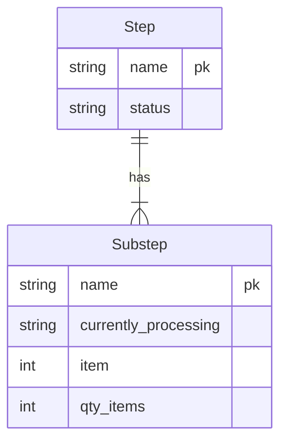

# Progress data structure

```mermaid

erDiagram

    Step ||--|{ Substep: has

    Step{
        string name pk
        string status
    }

    Substep{
        string name pk
        string currently_processing
        int item
        int qty_items
    }


```